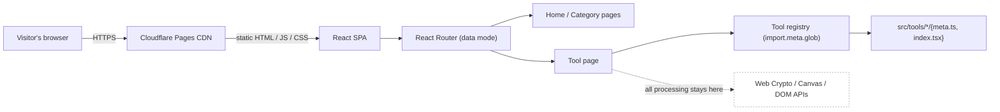
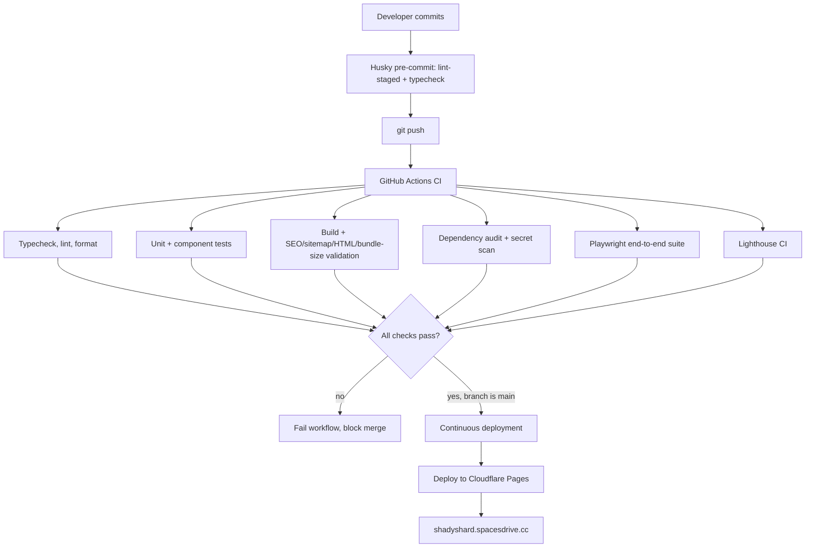

<div align="center">
  

  <h1>ShadyShard</h1>

  <p><strong>Privacy-first browser tools. Everything runs locally.</strong></p>
  <p>90+ fast, free, browser-based utilities. No uploads, no accounts, no tracking, no backend.</p>

  <p>
    <a href="https://github.com/spacesdrive/shadyshard/actions/workflows/ci.yml"></a>
    <a href="https://github.com/spacesdrive/shadyshard/actions/workflows/cd.yml"></a>
    <a href="https://github.com/spacesdrive/shadyshard/actions/workflows/codeql.yml"></a>
    <a href="LICENSE"></a>
    <a href="https://github.com/spacesdrive/shadyshard/stargazers"></a>
    <a href="https://github.com/spacesdrive/shadyshard/commits/main"></a>
  </p>

  <p>
    <a href="https://shadyshard.spacesdrive.cc"><strong>Live site</strong></a>
    &nbsp;-&nbsp;
    <a href="docs/index.md">Documentation</a>
    &nbsp;-&nbsp;
    <a href="#contributing">Contributing</a>
    &nbsp;-&nbsp;
    <a href="docs/engineering/tool-development.md">Add a tool</a>
  </p>
</div>

<br />

## Contents

- [Why ShadyShard](#why-shadyshard)
- [Features](#features)
- [Architecture](#architecture)
- [Quick start](#quick-start)
- [Scripts](#scripts)
- [Adding a new tool](#adding-a-new-tool)
- [Testing](#testing)
- [CI/CD](#cicd)
- [Project structure](#project-structure)
- [Documentation](#documentation)
- [Contributing](#contributing)
- [Security](#security)
- [License](#license)

## Why ShadyShard

Most online utility sites (converters, formatters, generators, calculators) send your input to a server to process it. That means every JSON payload, password idea, or image you paste into one of them passes through infrastructure you don't control and usually can't see the logs of.

ShadyShard takes the opposite approach: every tool is a static page that does its work with the Web Crypto API, the Canvas API, and plain JavaScript, entirely inside the browser tab you're already in. Nothing you type or upload is ever transmitted anywhere. There is no server to send it to, because there is no server at all, the entire site is static assets on a CDN.

That constraint also shapes how the project is built: no accounts to manage, no database to migrate, no API to version, and no backend outage that takes the product down. The trade-off is explicit and permanent, documented in [`docs/architecture/decisions.md`](docs/architecture/decisions.md).

## Features

| Category      | Examples                                                                                                                                             |
| ------------- | ---------------------------------------------------------------------------------------------------------------------------------------------------- |
| Developer     | JSON formatter, validator, minifier, diff; Base64, URL, HEX, and binary encode/decode; UUID and Nano ID generators; SHA-256; JWT decoder; URL parser |
| Text          | Word/character counters, case converter, slug generator, duplicate-line remover, Markdown preview, HTML escape                                       |
| Image         | Compressor, resizer, cropper, format converters (PNG, JPG, WebP), SVG optimizer, EXIF remover, favicon generator                                     |
| PDF           | Merge, split, extract/rotate/reorder/delete pages, compress, metadata view/remove, text extraction, PDF-to-images, images-to-PDF, password checker   |
| Converters    | Markdown/HTML, CSV/JSON/XML/YAML/TSV, and unit/format converters                                                                                     |
| Color and CSS | Color converter, gradient generator, contrast checker, box-shadow/border-radius/grid/flexbox generators                                              |
| SEO           | Meta tag generator, robots.txt generator, sitemap generator, Open Graph preview                                                                      |
| QR            | QR code generator and camera-based scanner                                                                                                           |
| Security      | Password generator, password strength checker, file hashing, checksum verification, file signature/MIME inspection                                   |
| Utilities     | Age, percentage, GST, and date-difference calculators; browser info, clipboard inspector, user agent parser                                          |
| Student Tools | Unofficial IITM BS CGPA, credit, and degree-progress calculators; semester, study, and exam planners                                                 |

Every tool ships with a responsive layout, full dark and light mode, keyboard accessibility, copy and download buttons where relevant, inline validation, and its own SEO metadata and structured data, generated automatically from a single `meta.ts` file. See [Features in depth](docs/architecture/ARCHITECTURE.md#6-metadata-and-seo).

## Architecture

ShadyShard is a static single-page application: React 19 and TypeScript, built with Vite, deployed as pre-built static files. There is no backend, no API, and no database anywhere in the system.



Every tool folder contributes its own metadata and component; the tool registry (`src/lib/tool-registry.ts`) discovers them automatically at build time, so routing, the search index, the sitemap, category listings, and related-tools links are all derived, not hand-maintained. Adding tool number 500 touches exactly two new files and zero existing ones. Full technical detail: [`docs/architecture/ARCHITECTURE.md`](docs/architecture/ARCHITECTURE.md); the reasoning behind each major decision: [`docs/architecture/decisions.md`](docs/architecture/decisions.md).

## Quick start

Requires Node.js 22 and npm 10 or newer.

```bash
git clone https://github.com/spacesdrive/shadyshard.git
cd shadyshard
npm ci
npm run dev
```

Open `http://localhost:5173`. That's the whole setup, there are no environment variables, API keys, or external services to configure.

## Scripts

| Command                     | Does                                                                        |
| --------------------------- | --------------------------------------------------------------------------- |
| `npm run dev`               | Start the Vite dev server.                                                  |
| `npm run build`             | Generate SEO files, typecheck, and produce the production build in `dist/`. |
| `npm run preview`           | Preview the production build locally.                                       |
| `npm test`                  | Run the Vitest unit/component suite.                                        |
| `npm run test:coverage`     | Run Vitest with a coverage report.                                          |
| `npm run test:e2e`          | Run the full Playwright end-to-end suite.                                   |
| `npm run lint`              | Run Oxlint.                                                                 |
| `npm run format`            | Format the codebase with Prettier.                                          |
| `npm run typecheck`         | Typecheck without building (`tsc -b`).                                      |
| `npm run validate:metadata` | Validate every tool's SEO metadata.                                         |
| `npm run validate:sitemap`  | Validate `sitemap.xml`/`robots.txt` against the tool registry.              |
| `npm run size`              | Check production bundle sizes against budget.                               |
| `npm run generate:seo`      | Regenerate `public/sitemap.xml` and `robots.txt`.                           |

Full command reference, including flags: [`docs/reference/quick-reference.md`](docs/reference/quick-reference.md).

## Adding a new tool

Create `src/tools/<slug>/`:

- `meta.ts`, default-exports a `ToolMeta` object (see [`src/types/tool.ts`](src/types/tool.ts))
- `index.tsx`, default-exports the tool's React component

That's the entire integration surface. Routing, navigation, the search index, the sitemap, related-tools linking, and structured data are all generated automatically from [`src/lib/tool-registry.ts`](src/lib/tool-registry.ts) via `import.meta.glob`, no other file needs to change. Full walkthrough: [`docs/engineering/tool-development.md`](docs/engineering/tool-development.md).

## Testing

Three layers, all enforced in CI on every push and pull request:

- **Unit tests** (Vitest), shared logic, most importantly the tool registry's invariants (`src/lib/tool-registry.test.ts`): unique slugs, unique descriptions, every tool resolving to a real category.
- **Component tests** (Vitest and React Testing Library), shared UI components and a representative tool per interaction shape.
- **End-to-end tests** (Playwright, across Chromium, Firefox, WebKit, and a mobile viewport), navigation, search, routing, accessibility via axe-core, console errors, and tool functionality.

Coverage is intentionally scoped to shared infrastructure rather than every individual tool, see [`docs/testing/testing.md`](docs/testing/testing.md#test-coverage-philosophy) for the reasoning. Run everything locally with `npm test` and `npm run test:e2e`.

## CI/CD

Every push and pull request runs the full quality gate before anything can merge or deploy.



Pull requests additionally run dependency review and a Conventional Commits PR-title check; CodeQL runs static analysis on every push and weekly on a schedule; Dependabot opens grouped weekly update PRs for both npm and GitHub Actions dependencies. Branch protection on `main` requires the full check suite to pass before a merge is allowed. Full pipeline detail, job by job, and a troubleshooting guide: [`docs/ci-cd/ci-cd.md`](docs/ci-cd/ci-cd.md).

## Project structure

```
src/
  pages/          One file per route (Home, ToolPage, CategoryPage, ...)
  tools/          One folder per tool: meta.ts + index.tsx
  components/
    layout/       Header, footer, breadcrumbs, page shell
    seo/          Structured data and meta tag rendering
    search/       Client-side fuzzy search (Fuse.js)
    tool/         Shared tool-page chrome and utilities (CopyButton, FileDropZone, ...)
    ui/           shadcn/ui primitives on Base UI
  hooks/          Theme, search index
  lib/            Tool registry, categories, SEO builders, crypto/heuristic utilities
  routes/         React Router (data mode) route tree
scripts/          Sitemap generation and CI validation scripts
e2e/              Playwright end-to-end specs
docs/             Full project documentation (architecture, SEO, accessibility, CI/CD, ...)
```

## Documentation

Full documentation lives in [`docs/`](docs/index.md).

| Document                                                                       | Covers                                             |
| ------------------------------------------------------------------------------ | -------------------------------------------------- |
| [`docs/architecture/ARCHITECTURE.md`](docs/architecture/ARCHITECTURE.md)       | The system as actually implemented                 |
| [`docs/architecture/decisions.md`](docs/architecture/decisions.md)             | Why it's built this way                            |
| [`docs/engineering/standards.md`](docs/engineering/standards.md)               | Code-level conventions                             |
| [`docs/engineering/tool-development.md`](docs/engineering/tool-development.md) | How to add one tool, end to end                    |
| [`docs/seo/seo-standards.md`](docs/seo/seo-standards.md)                       | Metadata, structured data, sitemap requirements    |
| [`docs/ui/design-system.md`](docs/ui/design-system.md)                         | Design tokens and component conventions            |
| [`docs/accessibility/accessibility.md`](docs/accessibility/accessibility.md)   | Accessibility rules and verification               |
| [`docs/performance/performance.md`](docs/performance/performance.md)           | Performance targets and measured baseline          |
| [`docs/testing/testing.md`](docs/testing/testing.md)                           | Automated test conventions and manual verification |
| [`docs/ci-cd/ci-cd.md`](docs/ci-cd/ci-cd.md)                                   | The full CI/CD pipeline and troubleshooting        |
| [`docs/git/git-workflow.md`](docs/git/git-workflow.md)                         | Commit conventions and branch policy               |

## Contributing

1. Branch off `main`. Commit using [Conventional Commits](https://www.conventionalcommits.org/) (enforced by a Husky `commit-msg` hook: `feat:`, `fix:`, `docs:`, `test:`, `chore:`, and so on).
2. Husky's `pre-commit` hook lints, formats, and typechecks staged changes automatically, no manual step required.
3. Open a pull request against `main`. CI and PR validation (dependency review, PR title convention) must pass before merging.

New to the project? [`docs/engineering/tool-development.md`](docs/engineering/tool-development.md) is the fastest path to a first real contribution: adding one tool touches exactly two new files. Full conventions: [`docs/git/git-workflow.md`](docs/git/git-workflow.md).

## Security

There is no server, no database, and no user data collected, which removes entire classes of vulnerability by construction. The remaining surface (dependencies, the static build, the deploy pipeline) is covered by CodeQL static analysis, automated dependency audits, secret scanning, and Dependabot updates on every change, see [`docs/ci-cd/ci-cd.md`](docs/ci-cd/ci-cd.md). To report a vulnerability, open an issue or contact the maintainer directly rather than filing a public report for anything sensitive.

## License

[MIT](LICENSE)
